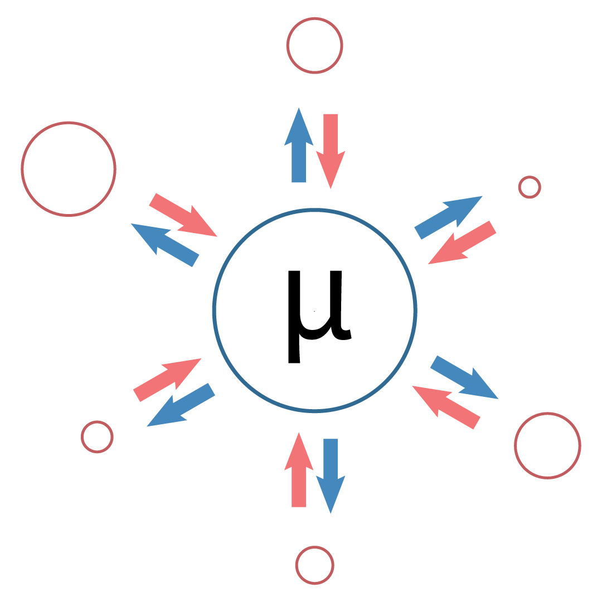

# Background

A system is in thermal equilibrium with a temperature bath. In other words, the
system is not isolated; it is surrounded by another system that is a certain
temperature.

The probability $p_\mu$ of being in a state $\mu$ with energy $E_\mu$ is

$$
\begin{equation}
p_\mu = \frac{1}{Z} \exp{(-\beta E_\mu)}.
\end{equation}
$$

Here,

$$
\begin{equation}
Z = \sum_\mu \exp{(-\beta E_\mu)}
\end{equation}
$$

is the *partition function* and 

$$
\begin{equation}
\beta = \frac{1}{kT}
\end{equation}
$$

is the *Boltzmann distribution*, where $k$ is Boltzmann's constant. At
equilibrium, the following must be true:

$$
\begin{equation}
\sum_\nu p_\mu P(\mu \to \nu) = \sum_\nu p_\nu P(\nu \to \mu)
\end{equation}
$$

where $P(\mu \to \nu)$ is the probability of going from state $\mu$ to state
$\nu$.

<!-- This means that the the sum (over all states $\nu$) of the probability of
being in a state $\mu$ times the probability of going to another state $\nu$ is
equal to the sum (over all states $\nu$) of the probability of being in all other 
states $\nu$ and going to initial state $\mu$. -->

Take a look at the following illustration for another explanation.

Courtesy of Gabriel C. Orlando.

Each circle represents the probability of each state. The blue circle is state
$\mu$, while the red circles represent the various states $\nu$. The blue arrows
represent the probability of a change of state from $\mu$ to another state
$\nu$, $P(\mu \to \nu)$, and the red arrows are the probability of a change of 
state from $\nu$ to $\mu$, $P(\nu \to \mu)$. The sum of the product between blue 
circle and each blue arrow must be equal to the sum of the product of each red 
circle with its respective red arrow.

For our numerical methods, this is difficult to enforce, but we can make
it be true by setting the *detailed balance condition*:

$$
\begin{equation}
p_\mu P(\mu \to \nu) = p_\nu P(\nu \to \mu)
\end{equation}
$$

You can write the first formula as the second when considering each pair of
states $\mu$ and $\nu$ individually. The sum in the first equation implies that
the detailed balance holds for each term in the sum, meaning each individual
pair of transitions between states $\mu$ and $\nu$ must balance out. This is
because if the total sum of transitions in and out of each state is equal, then
for each specific pair of states, the individual transitions must also balance.

# The Ising Model

The *Ising model* is the model for ferromagnetic materials, which are materials that exhibit spontaneous net magnetization at the atomic level, even in the absence of an external magnetic field.

We have a lattice of atoms, such as iron atoms, and these atoms are either spin up (+1) or spin down (-1). For example, in the image below, there is a 2D lattice where the spin up is represented by the blue arrow and spin down is represented by the red arrow. They are distributed in a lattice and they are equally spaced apart.

We know that the total energy in this state (this lattice) is $E_\mu$, which is

$$
\begin{equation}
E_\mu = \sum_{<i,j>} -J_{ij} \sigma_i \sigma_j
\end{equation}
$$

where $\sigma_i$ is the spin of a single particle in the lattice (either -1 or +1) and the sum over $<i,j>$ means summing over the nearest neighbors of all points in the lattice (up, down, left, and right). $J_{ij}$ is the interaction between spins $i$ and $j$. The condition $J_{ij} > 0$ must be obeyed in order for the interaction to be ferromagnetic.

$\mu$ corresponds to a particular configuration of the spins.

Now, satisfying detailed balance:

$$
\begin{equation}
\frac{P(\mu \to \nu)}{P(\nu \to \mu)} = \frac{p_\nu}{p_\mu} = \exp{[-\beta (E_\nu - E_\mu)]}
\end{equation}
$$

# The Metropolis-Hastings Algorithm

The Metropolis-Hastings algorithm is a sort of Markov chain Monte Carlo (MCMC) method. MCMC methods sample from a probability distribution. By constructing a Markov chain that has the desired distribution as its equilibrium distribution, one can obtain a sample of the desired distribution by recording states from the chain. The more steps that are included, the more closely the distribution of the sample matches the actual desired distribution.

The Metropolis-Hastings algorithm is a type of MCMC method that obtains a sequence of random samples from a probability distribution which direct sampling is difficult. The sequence can be used to approximate the distribution (e.g. to generate a histogram) or to compute an integral (e.g. an expected value). 

*The idea:* We want to find the equilibrium state $\mu$ in the magnet at a particular temperature $\beta$ (how many $\sigma_i$s are +1 and how many are -1). We will start with a random lattice of spins, some pointing up and some pointing down, and make it dance around using the equation above until it fixes itself into equilibrium.

The algorithm steps are the following:

1. Call the current state $\mu$.
2. Pick a random particle on the lattice and flip the spin sign. Call that the state $\nu$. We want to find the probability that $P(\mu\to\nu)$ that we'll accept this new state.
    
    1. If $E_\nu > E_\mu$, then set $P(\nu \to \mu) = 1$ and thus by the detailed balance equation $P(\mu \to \nu) = \exp(-B(E_\nu-E_\mu))$.
    2. If $E_\nu < E_\mu$, then set $P(\mu \to \nu) = 1$ and thus by the detailed balance equation $P(\nu \to \mu) = \exp(-B(E_\nu-E_\mu))$.

3. Change to state $\nu$ (i.e., flip the spin of the particle) with the probabilities outlined above.
4. Go back to step 1. Repeat the whole thing many times and eventually you'll force out an equilibrium state.

Thus, the only thing that needs to be evaluated is $-\beta(E_\nu-E_\mu)=\beta*J*\sum_{k=1}^4\sigma_i \sigma_k$ where $i$ is the spin being flipped and $\sigma_k$ are the four nearest neighbors to that spin (two dimensions). On the boundaries, sometimes things might have less than 4 neighbors.